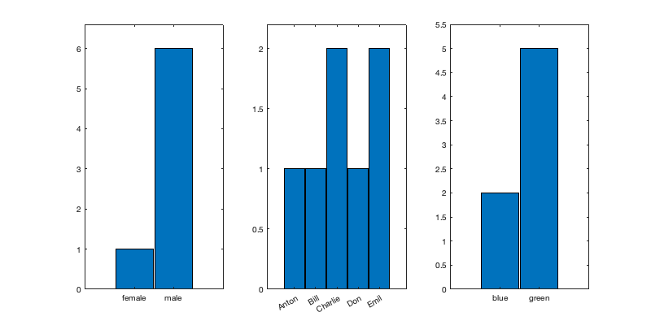
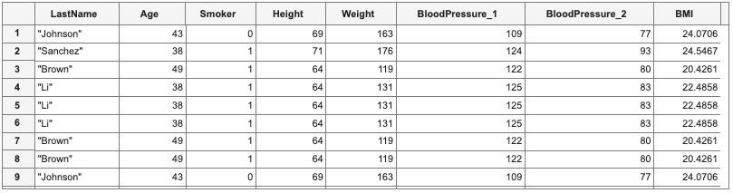
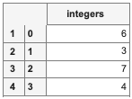
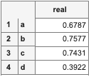
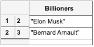

# Pandas<->Matlab
The functions are designed to convert Pandas DataFrames and Series to Matlab and back.
Function *df2t* converts DataFrames and Series to Matlab in memory w/o saving anthing to the disk, while *t2df* converts Table to DataFrame.

## Make sure to set up Python in Matlab
```Matlab
pe = pyenv;
if pe.Status == "NotLoaded"
    [~,exepath] = system("where python");
    pe = pyenv('Version',exepath);
end
```

## Create a simple dataframe from json and convert to Table
```Matlab
jsonData = "{'gender': (['male'] * 6)+['female']," + ...
       "'name': ['Anton', 'Bill', 'Charlie', 'Don', 'Emil', 'Emil', 'Charlie']," +...
       "'eye_color': ['blue', 'green', 'green', 'green', 'blue', 'green', 'green']}";
df = py.pandas.DataFrame(py.eval(jsonData, py.dict()));
testTable = df2t(df);
% plot the statistics
figure("Color","white", "Position", [0,0,800,400])
subplot(1,3,1), hist(categorical(testTable.gender))
subplot(1,3,2), hist(categorical(testTable.name))
subplot(1,3,3), hist(categorical(testTable.eye_color))
```

## Create a Table and convert it to DataFrame
```Matlab
% then use Pandas to sample from it and create new dataframe, and convert it to Table
Name            = {["Roger", "Sanchez"];
                   ["Paul", "Johnson"];
                   ["Lisa", "Li"];
                   ["Don", "Diaz"];
                   ["Havana ", "Brown"]};
Age             = [38;43;38;40;49];
Smoker          = logical([1;0;1;0;1]);
Height          = [71;69;64;67;64];
Weight          = [176;163;131;133;119];
BloodPressure   = [124 93; 109 77; 125 83; 117 75; 122 80];
T = table(Name,Age,Smoker,Height,Weight,BloodPressure);
T.BMI           = (T.Weight * 0.453592)./(T.Height * 0.0254).^2;
df              = t2df(T);
% Sample from the dataframe
df_sampled      = df.sample(int64(10), replace=true);
table_sampled   = df2t(df_sampled)
```

## Convert a Series to Table
```Matlab
% Create a Series of random integers using numpy.random and convert to table 
rng = py.numpy.random.RandomState(int64(42));
integers = rng.randint(int64(0), int64(10), int64(4));
pySeries = py.pandas.Series(integers, pyargs('name', 'integers'));
matSeries = df2t(pySeries)
```

```Matlab
% Create a Series of random integers using Matlab rand with letters as indexes
% and convert to Matlab.
pySeries = py.pandas.Series(rand(1,4), pyargs('name', 'real','index', {'a', 'b', 'c', 'd'}));
df2t(pySeries)
```

```Matlab
% Create a Series of strings 
data_list = {"Jeff Bezos", "Elon Musk",...
             "Bernard Arnault", "Bill Gates", "Warren Buffett"};
pySeries = py.pandas.Series(data_list, pyargs('name', 'Billioners','index', int64([1:numel(data_list)])));
billioners = df2t(pySeries);
billioners([2:3],:)
```

